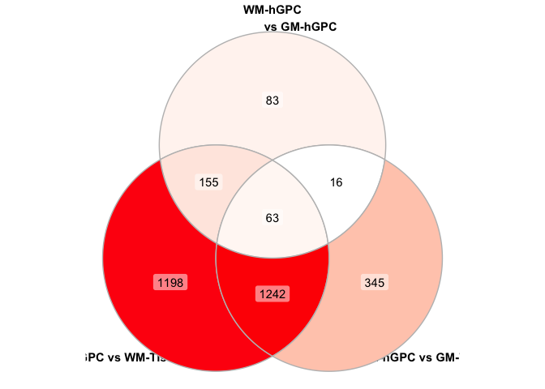

Microarray analysis of white and grey matter tissue and GPCs from adult
human brain
================
John Mariani
2/4/2020

-   [Load libraries for analysis](#load-libraries-for-analysis)
-   [Initial Data Processing](#initial-data-processing)
-   [Remove absent and ambiguous
    probes](#remove-absent-and-ambiguous-probes)
-   [Correct for batches via ComBat](#correct-for-batches-via-combat)
-   [Differential Expression via
    Limma](#differential-expression-via-limma)
-   [Make Marker HM](#make-marker-hm)
    -   [Import IPA data](#import-ipa-data)
    -   [Spinglass community network
        analysis](#spinglass-community-network-analysis)
-   [Curated Gene Heatmaps](#curated-gene-heatmaps)
    -   [Figure Layout](#figure-layout)

## Load libraries for analysis

``` r
library(biomaRt)
library(limma)
library(affy)
library(panp)
library(stringr)
library(ggfortify)
library(pheatmap)
library(hgu133plus2.db)
library(sva)
library(EDASeq)
library(ggVennDiagram)
library(tidyverse)
library(magrittr)
library(data.table)
library(igraph)
library(plyr)
library(patchwork)
library(xlsx)
```

## Initial Data Processing

``` r
#Function used throughout
`%not in%` <- function (x, table) is.na(match(x, table, nomatch=NA_integer_))

#Read in and run RMA on CEL files
dataFolder <- "data_for_import/"
fns <- list.celfiles(path = dataFolder)
Data <- ReadAffy(filenames=paste0(dataFolder,fns))
eset <- rma(Data)
```

    ## Warning: replacing previous import 'AnnotationDbi::tail' by 'utils::tail' when
    ## loading 'hgu133plus2cdf'

    ## Warning: replacing previous import 'AnnotationDbi::head' by 'utils::head' when
    ## loading 'hgu133plus2cdf'

    ## 

    ## Background correcting
    ## Normalizing
    ## Calculating Expression

``` r
#Present Absent Calls using PANP
PA <- pa.calls(eset, looseCutoff = 0.01, tightCutoff = 0.01)
```

    ## 
    ## Processing 16 chips:

    ## Warning in regularize.values(x, y, ties, missing(ties)): collapsing to unique
    ## 'x' values

    ## #

    ## Warning in regularize.values(x, y, ties, missing(ties)): collapsing to unique
    ## 'x' values

    ## #

    ## Warning in regularize.values(x, y, ties, missing(ties)): collapsing to unique
    ## 'x' values

    ## #

    ## Warning in regularize.values(x, y, ties, missing(ties)): collapsing to unique
    ## 'x' values

    ## #

    ## Warning in regularize.values(x, y, ties, missing(ties)): collapsing to unique
    ## 'x' values

    ## #

    ## Warning in regularize.values(x, y, ties, missing(ties)): collapsing to unique
    ## 'x' values

    ## #

    ## Warning in regularize.values(x, y, ties, missing(ties)): collapsing to unique
    ## 'x' values

    ## #

    ## Warning in regularize.values(x, y, ties, missing(ties)): collapsing to unique
    ## 'x' values

    ## #

    ## Warning in regularize.values(x, y, ties, missing(ties)): collapsing to unique
    ## 'x' values

    ## #

    ## Warning in regularize.values(x, y, ties, missing(ties)): collapsing to unique
    ## 'x' values

    ## #

    ## Warning in regularize.values(x, y, ties, missing(ties)): collapsing to unique
    ## 'x' values

    ## #

    ## Warning in regularize.values(x, y, ties, missing(ties)): collapsing to unique
    ## 'x' values

    ## #

    ## Warning in regularize.values(x, y, ties, missing(ties)): collapsing to unique
    ## 'x' values

    ## #

    ## Warning in regularize.values(x, y, ties, missing(ties)): collapsing to unique
    ## 'x' values

    ## #

    ## Warning in regularize.values(x, y, ties, missing(ties)): collapsing to unique
    ## 'x' values

    ## #

    ## Warning in regularize.values(x, y, ties, missing(ties)): collapsing to unique
    ## 'x' values

    ## #
    ## Processing complete.
    ## 
    ## 
    ## Intensities at cutoff P-values of  0.01  and  0.01 :
    ## Array:           value at 0.01    value at 0.01 
    ## GM_A2B5_A.CEL     7.93        7.93 
    ## GM_A2B5_B.CEL     7.86        7.86 
    ## GM_A2B5_C.CEL     8.23        8.23 
    ## GM_A2B5_D.CEL     7.67        7.67 
    ## GM_Unsorted_A.CEL     8.43        8.43 
    ## GM_Unsorted_B.CEL     7.78        7.78 
    ## GM_Unsorted_C.CEL     7.93        7.93 
    ## GM_Unsorted_D.CEL     7.71        7.71 
    ## WM_A2B5_A.CEL     8.06        8.06 
    ## WM_A2B5_B.CEL     7.67        7.67 
    ## WM_A2B5_C.CEL     7.73        7.73 
    ## WM_A2B5_D.CEL     7.7         7.7 
    ## WM_Unsorted_A.CEL     7.79        7.79 
    ## WM_Unsorted_B.CEL     7.83        7.83 
    ## WM_Unsorted_C.CEL     7.72        7.72 
    ## WM_Unsorted_D.CEL     7.69        7.69 
    ## 
    ## [NOTE: 'Collapsing to unique x values...' warning messages are benign.]

``` r
PAcalls <- data.frame(PA$Pcalls)
names(PAcalls) <- str_split_fixed(names(PAcalls), "[.]",n=2)[,1]

#Import Sample Data
sampleTable <- read.csv("data_for_import/SampleInfo.csv", stringsAsFactors = T)
sampleTable <- sampleTable[match(names(PAcalls),sampleTable$Sample),]
```

## Remove absent and ambiguous probes

``` r
PAlist <- apply(PAcalls[,names(PAcalls) %in% sampleTable[sampleTable$Sort == "A2B5",]$Sample], 1, paste, collapse=",")
PAcalls$val <- PAlist

AList <- PAcalls[PAcalls$val == paste(rep("A",length(sampleTable[sampleTable$Sort == "A2B5",]$Sample)),collapse=","),]

PList <- PAcalls[row.names(PAcalls) %not in% row.names(AList),]

edata <- data.frame(exprs(eset))
names(edata) <- gsub(names(edata), pattern = ".CEL", replacement = "")

probeAnnotation <- AnnotationDbi::select(hgu133plus2.db, row.names(edata), c("SYMBOL"))
```

    ## 'select()' returned 1:many mapping between keys and columns

``` r
edata <- data.frame(edata[row.names(edata) %in% row.names(PList),])
duplicatedList <- probeAnnotation[duplicated(probeAnnotation$PROBEID) == T,]
edata <- edata[row.names(edata) %not in% duplicatedList$PROBEID,]
edataLabeled <- merge(edata, probeAnnotation, by.x=0, by.y="PROBEID")
edataLabeled <- edataLabeled[is.na(edataLabeled$SYMBOL) == F,]
edata <- data.frame(edata)
edata <- edata[row.names(edata) %in% edataLabeled$Row.names,]

dim(edata)
```

    ## [1] 9995   16

## Correct for batches via ComBat

``` r
modcombat = model.matrix(~1, data=eset)
combat_edata = ComBat(dat=as.matrix(edata), batch=sampleTable$ScanDate, mod=modcombat, par.prior=TRUE, prior.plots=FALSE)
```

    ## Found2batches

    ## Adjusting for0covariate(s) or covariate level(s)

    ## Standardizing Data across genes

    ## Fitting L/S model and finding priors

    ## Finding parametric adjustments

    ## Adjusting the Data

``` r
combatLabeled <- merge(combat_edata, probeAnnotation, by.x = 0, by.y = 1)
combat_edata_pca <- combat_edata
colnames(combat_edata_pca) <- c("GM-hGPC A", "GM-hGPC B", "GM-hGPC C", "GM-hGPC D", "GM-Tissue A", "GM-Tissue B", "GM-Tissue C", "GM-Tissue D", "WM-hGPC A", "WM-hGPC B", "WM-hGPC C", "WM-hGPC D", "WM-Tissue A", "WM-Tissue B", "WM-Tissue C", "WM-Tissue D")


pca <- autoplot(prcomp(t(combat_edata_pca)), y = 4, x = 2, data = sampleTable, colour = "Group", frame = T, label = F) + theme_bw() + scale_colour_manual(values = c("blue", "red", "green", "purple"))
```

    ## Warning: `group_by_()` was deprecated in dplyr 0.7.0.
    ## Please use `group_by()` instead.
    ## See vignette('programming') for more help

``` r
pca
```

<!-- -->

## Differential Expression via Limma

``` r
sampleTable$SID <- factor(sampleTable$SID)
attach(sampleTable)
design <- model.matrix(~0+Group+ScanDate)
colnames(design) <- make.names(colnames(design))

corfit <- duplicateCorrelation(combat_edata,design,block=SID)
fitV <- lmFit(combat_edata, design, block=SID, cor=corfit$consensus)
fitV2 <- eBayes(fitV)
colnames(design)
```

    ## [1] "GroupA2B5posCTX"  "GroupA2B5posWM"   "GroupunsortedCTX" "GroupunsortedWM" 
    ## [5] "ScanDate8.24.06"

``` r
cont.matrix <- makeContrasts(WM_vs_GM_A2B5 = GroupA2B5posWM - GroupA2B5posCTX,
                             WM_A2B5_vs_WM_Tissue = GroupA2B5posWM - GroupunsortedWM,
                             GM_A2B5_vs_GM_Tissue = GroupA2B5posCTX - GroupunsortedCTX,
                             WM_Tissue_vs_GM_Tissue = GroupunsortedWM - GroupunsortedCTX,
                             levels=design)

fitV2 <- contrasts.fit(fitV2, cont.matrix)
fitV2 <- eBayes(fitV2)

WM_vs_GM_A2B5 <- merge(topTable(fitV2, coef = 1,number = 1000000000, p.value = 0.05),combatLabeled, by.x=0,by.y=1)
WM_A2B5_vs_WM_Tissue <- merge(topTable(fitV2, coef = 2,number = 1000000000, p.value = 0.05),combatLabeled, by.x=0,by.y=1)
GM_A2B5_vs_GM_Tissue <- merge(topTable(fitV2, coef = 3,number = 1000000000, p.value = 0.05),combatLabeled, by.x=0,by.y=1)
WM_Tissue_vs_GM_Tissue <- merge(topTable(fitV2, coef = 4,number = 1000000000, p.value = 0.05),combatLabeled, by.x=0,by.y=1)

table(WM_vs_GM_A2B5$logFC >0)
```

    ## 
    ## FALSE  TRUE 
    ##   255    93

``` r
VennWmGm <- list("WM-hGPC enriched
                 vs GM-hGPC" = WM_vs_GM_A2B5[WM_vs_GM_A2B5$logFC > 0,]$SYMBOL,
                 "WM-hGPC vs WM-Tissue" = WM_A2B5_vs_WM_Tissue$SYMBOL,
                 "GM-hGPC vs GM-Tissue" = GM_A2B5_vs_GM_Tissue$SYMBOL,
                 "GM-hGPC enriched
                 vs WM-hGPC" = WM_vs_GM_A2B5[WM_vs_GM_A2B5$logFC < 0,]$SYMBOL)

venn <- ggVennDiagram(VennWmGm, label = "count") + theme(legend.position = "none")
venn
```

<!-- -->

``` r
#### Other Venn

VennWmGm2 <- list("WM-hGPC
                 vs GM-hGPC" = WM_vs_GM_A2B5$SYMBOL,
                 "WM-hGPC vs WM-Tissue" = WM_A2B5_vs_WM_Tissue$SYMBOL,
                 "GM-hGPC vs GM-Tissue" = GM_A2B5_vs_GM_Tissue$SYMBOL)

venn2 <- ggVennDiagram(VennWmGm2, label = "count") + theme(legend.position = "none")
venn2
```

<!-- -->

``` r
#####

cleanDE <- function(de){
  temp <- de[,c(1,2,6,24)]
  names(temp) <- c("Probe", "Log2FC", "Adj Pval", "Gene")
  return(temp)
}

WM_vs_GM_A2B5_clean <- cleanDE(WM_vs_GM_A2B5)
WM_A2B5_vs_WM_Tissue_clean <- cleanDE(WM_A2B5_vs_WM_Tissue)
GM_A2B5_vs_GM_Tissue_clean <- cleanDE(GM_A2B5_vs_GM_Tissue)

## Write out DE genesets if desired
#write.xlsx(WM_vs_GM_A2B5_clean, "output/Differential Expression.xlsx", row.names = F, append = T, sheetName = "WM A2B5 vs GM A2B5")
#write.xlsx(WM_A2B5_vs_WM_Tissue_clean, "output/Differential Expression.xlsx", row.names = F, append = T, sheetName = "WM A2B5 vs WM Tissue")
#write.xlsx(GM_A2B5_vs_GM_Tissue_clean, "output/Differential Expression.xlsx", row.names = F, append = T, sheetName = "GM A2B5 vs GM Tissue")
```

## Make Marker HM

``` r
CNSgenes <- c("MBP", "GLUL", "CNP", "MOBP", "SOX2", "OLIG1", "OLIG2", "ST8SIA1", "CSPG4", "ASCL1", "FABP7", "PDGFRA", "SOX1", "DCX", "SLC1A2")

cnsProbes <- combatLabeled[combatLabeled$SYMBOL %in% CNSgenes,]

cnsProbes$median <- rowMedians(as.matrix(cnsProbes[,2:17]))
cnsProbes <- cnsProbes[order(cnsProbes$median, decreasing = T),]
cnsProbes <- cnsProbes[!duplicated(cnsProbes$SYMBOL),]
cnsProbes <- cnsProbes[match(CNSgenes, cnsProbes$SYMBOL),]
row.names(cnsProbes) <- cnsProbes$SYMBOL
cnsProbes <- cnsProbes[,2:17]


my_palette <- colorRampPalette(c("#009900","#fffcbd","#ff2020"))(n=299)

scale_rows = function(x){
  m = apply(x, 1, mean, na.rm = T)
  s = apply(x, 1, sd, na.rm = T)
  return((x - m) / s)
}

cnsProbes <- scale_rows(cnsProbes)

cnsProbesHM <- cnsProbes %>% set_rownames(row.names(.))  %>%
  as_tibble(rownames = "row") %>%
  pivot_longer(-row, names_to = "Sample", values_to = "Gene Z-Score")

cnsProbesHM$group <- substr(cnsProbesHM$Sample,1,nchar(cnsProbesHM$Sample)-2)
cnsProbesHM$Sample <- factor(cnsProbesHM$Sample, levels = names(cnsProbes))
cnsProbesHM$row <- factor(cnsProbesHM$row, levels = rev(row.names(cnsProbes)))
cnsProbesHM$group <- factor(cnsProbesHM$group, levels = c("WM_A2B5", "GM_A2B5", "WM_Unsorted", "GM_Unsorted"))


cnsHMgg <- ggplot(cnsProbesHM, aes(Sample, row)) + theme_bw() + geom_tile(aes(fill = `Gene Z-Score`), colour = "black") + theme(legend.position = "bottom", legend.direction = "horizontal", axis.text.x = element_blank(), axis.ticks = element_blank(), axis.title = element_blank())  + scale_fill_gradientn(colours = c("#009900","#fffcbd","#ff2020"), values = scales::rescale(c(-0.9, -0.15, .15, 0.45, 0.9)), limits = c(-3,2))  + scale_y_discrete(expand = c(0,0), position = "right") + scale_x_discrete(expand = c(0,0)) + facet_grid(cols =  vars(group),scales = "free", space = "free", switch = "x")

cnsHMgg
```

<!-- -->

### Import IPA data

``` r
IPAparse <- function(files, compNames, pval = 0.05, filterTerms, ensembl, returnWhat = "Filtered"){
  for(i in 1:length(files)){
  canonicalIPA <- fread(files[i], skip = "Canonical",drop = c(4,6))
  names(canonicalIPA) <- c("Pathway", "pVal", "zScore", "Genes")
  canonicalIPA$type <- "Canonical"
  upstreamIPA <- fread(files[i], skip = "Upstream Regulators", drop = c(1:2,4:6,8:10,13:14))
  upstreamIPA <- upstreamIPA[,c(1,3,2,4)]
  names(upstreamIPA) <- c("Pathway", "pVal", "zScore", "Genes")
  upstreamIPA$Pathway <- paste0(upstreamIPA$Pathway, " Signaling")
  upstreamIPA$pVal <- -log10(upstreamIPA$pVal)
  upstreamIPA$type <- "Upstream"
  functionalIPA <- fread(files[i], skip = "Diseases and Bio", drop = c(1,2,5,7,8,10,11))
  names(functionalIPA) <- c("Pathway", "pVal", "zScore", "Genes")
  functionalIPA$pVal <- -log10(functionalIPA$pVal)
  functionalIPA$type <- "Functional"
  moleculesIPAtemp <- fread(files[i], skip = "Analysis Ready Molecules", drop = c(3:4))
  if(i == 1){
    IPA <- rbind(canonicalIPA, upstreamIPA, functionalIPA)
    IPA$comparison <- compNames[i]
    moleculesIPA <- moleculesIPAtemp
  } else {
    tempIPA <- rbind(canonicalIPA, upstreamIPA, functionalIPA)
    tempIPA$comparison <- compNames[i]
    IPA <- rbind(IPA, tempIPA)
    moleculesIPA <- rbind(moleculesIPA, moleculesIPAtemp)
  }
  }
  

  IPA[is.na(IPA$zScore)]$zScore <- 0
  ogIPA <- IPA
  IPA <- IPA[IPA$pVal > -log10(pval),]
  filteredIPA <- IPA[!grepl(paste(filterTerms, collapse = "|"), ignore.case = T, IPA$Pathway),]
  if(returnWhat == "Filtered"){
    return(filteredIPA)
  } 
  if(returnWhat == "Deleted"){
    deletedIPA <- IPA[grepl(paste(filterTerms, collapse = "|"), ignore.case = T, IPA$Pathway),]
    return(deletedIPA)
  }
  if(returnWhat == "Molecules"){
    moleculesIPA <- merge(moleculesIPA, ensembl, by.x = "ID", by.y = "SYMBOL")
    moleculesIPA <- moleculesIPA[!duplicated(moleculesIPA$Symbol),]
    return(moleculesIPA)
  }
}

IPAfilters <- c("cancer","glioma", "abdominal", "carcinoma", "endometrium", "eye", "nose", "epidermis", "head", "lymphocyte", "renal", "snout", "tooth", 
                 "connective", "tumor", "fibroblast", "rickets", "mouth", "maxilla", "cartilage", "neoplasm", "oma", "lymph", "liver", "psoriasis", "cardio",
                 "cardiac", "tongue", "disc", "tinea", "herpes", "Picornaviridae", "virus", "killer T", "muscle", "myopathy", "pancreatic", "Onychomycosis",
                 "leukocyte", "oral cavity","osteoclast", "Merkel", "macrophage", "Hydrometrocolpos", "Hand", "Gastric", "Thymocytes", "diabetes",
                 "Dupuytren", "myoblast", "ear$", "implantation", "bone", "limb", "cleft lip", "Calcinosis", "lung", "Benign lesion", 
                 "body axis", "sensory organ", "diabetic", "neutrophil", "infection of mammalia", "leukopoiesis", "neoplasia", "Sensory system development",
                 "T cell", "myeloid", "aorta", "body cavity", "esophagus", "incisor", "kidney", "oesophageal", "respiratory", "skin", "cavity", "urinary",
                 "foot", "digit", "heart", "acute biphenotypic leukemia", "Ankylosis", "Articular rigidity", "Atherosclero", "Blister", "Branching morphogenesis of epithelial tubule",
                 "Cervical spondylotic myelopathy", "epithelial", "exocrine", "gastrointestinal", "Ejection of first polar body", "Familial arrhythmia", "Familial nonsyndromic hearing impairment", 
                 "fibrosis", "mammary", "Hearing", "Morphogenesis of metanephric bud", "cochlea", "nail", "Plasma cell dyscrasia", "Secondary Leukemia", "granulocyte",
                 "Tinnitus", "metastasis", "trunk", "sperm motility", "skull", "dendritic cells", "dehydration", "digestive", "microphthalmia", "myelodysplastic",
                 "semicircular canal", " skeleton", "osteopenia", "osteoarthritis", "Refractory anemia with excess blasts", "Abnormal", "lymphocytes", "dendritic cells", "phagocytes", "immune", "mesenchymal", "phagocytic", "Bleeding", "apoptosis", "cell death", "damage", "degeneration", "vasculature", "mesodermal", "Infarction", "Injury", "Lesioning", "Megakaryocytopoiesis", "blood-brain barrier", "vascular", "Phagosome", "lesion", "In B Cell", "T Helper Cell", "Vasculogenesis", "Pentose Phosphate Pathway")


filteredIPA <- IPAparse(files = "data_for_import/IPA.txt", compNames = "WM_vs_GM_GPC", filterTerms = IPAfilters, ensembl = edataLabeled[,c(1,18)])
```

    ## Warning in fread(files[i], skip = "Canonical", drop = c(4, 6)): Detected 5
    ## column names but the data has 6 columns (i.e. invalid file). Added 1 extra
    ## default column name for the first column which is guessed to be row names or an
    ## index. Use setnames() afterwards if this guess is not correct, or fix the file
    ## write command that created the file to create a valid file.

    ## Warning in fread(files[i], skip = "Canonical", drop = c(4, 6)): Stopped early on
    ## line 459. Expected 6 fields but found 0. Consider fill=TRUE and comment.char=.
    ## First discarded non-empty line: <<Upstream Regulators for My Projects-
    ## >Adult_WM_vs_GM->WM_vs_GM_A2B5_Final - 2020-12-23 05:29 PM>>

    ## Warning in fread(files[i], skip = "Upstream Regulators", drop = c(1:2, 4:6, :
    ## Stopped early on line 600. Expected 14 fields but found 0. Consider fill=TRUE
    ## and comment.char=. First discarded non-empty line: <<Causal Networks for My
    ## Projects->Adult_WM_vs_GM->WM_vs_GM_A2B5_Final - 2020-12-23 05:29 PM>>

    ## Warning in fread(files[i], skip = "Diseases and Bio", drop = c(1, 2, 5, :
    ## Stopped early on line 1051. Expected 11 fields but found 0. Consider fill=TRUE
    ## and comment.char=. First discarded non-empty line: <<Tox Functions for My
    ## Projects->Adult_WM_vs_GM->WM_vs_GM_A2B5_Final - 2020-12-23 05:29 PM>>

``` r
deletedIPA <- IPAparse(files = "data_for_import/IPA.txt", compNames = "WM_vs_GM_GPC", filterTerms = IPAfilters, ensembl = edataLabeled[,c(1,18)], returnWhat = "Deleted")
```

    ## Warning in fread(files[i], skip = "Canonical", drop = c(4, 6)): Detected 5
    ## column names but the data has 6 columns (i.e. invalid file). Added 1 extra
    ## default column name for the first column which is guessed to be row names or an
    ## index. Use setnames() afterwards if this guess is not correct, or fix the file
    ## write command that created the file to create a valid file.

    ## Warning in fread(files[i], skip = "Canonical", drop = c(4, 6)): Stopped early on
    ## line 459. Expected 6 fields but found 0. Consider fill=TRUE and comment.char=.
    ## First discarded non-empty line: <<Upstream Regulators for My Projects-
    ## >Adult_WM_vs_GM->WM_vs_GM_A2B5_Final - 2020-12-23 05:29 PM>>

    ## Warning in fread(files[i], skip = "Upstream Regulators", drop = c(1:2, 4:6, :
    ## Stopped early on line 600. Expected 14 fields but found 0. Consider fill=TRUE
    ## and comment.char=. First discarded non-empty line: <<Causal Networks for My
    ## Projects->Adult_WM_vs_GM->WM_vs_GM_A2B5_Final - 2020-12-23 05:29 PM>>

    ## Warning in fread(files[i], skip = "Diseases and Bio", drop = c(1, 2, 5, :
    ## Stopped early on line 1051. Expected 11 fields but found 0. Consider fill=TRUE
    ## and comment.char=. First discarded non-empty line: <<Tox Functions for My
    ## Projects->Adult_WM_vs_GM->WM_vs_GM_A2B5_Final - 2020-12-23 05:29 PM>>

``` r
moleculesIPA <- IPAparse(files = "data_for_import/IPA.txt", compNames = "WM_vs_GM_GPC", filterTerms = IPAfilters, ensembl = edataLabeled[,c(1,18)], returnWhat = "Molecules")
```

    ## Warning in fread(files[i], skip = "Canonical", drop = c(4, 6)): Detected 5
    ## column names but the data has 6 columns (i.e. invalid file). Added 1 extra
    ## default column name for the first column which is guessed to be row names or an
    ## index. Use setnames() afterwards if this guess is not correct, or fix the file
    ## write command that created the file to create a valid file.

    ## Warning in fread(files[i], skip = "Canonical", drop = c(4, 6)): Stopped early on
    ## line 459. Expected 6 fields but found 0. Consider fill=TRUE and comment.char=.
    ## First discarded non-empty line: <<Upstream Regulators for My Projects-
    ## >Adult_WM_vs_GM->WM_vs_GM_A2B5_Final - 2020-12-23 05:29 PM>>

    ## Warning in fread(files[i], skip = "Upstream Regulators", drop = c(1:2, 4:6, :
    ## Stopped early on line 600. Expected 14 fields but found 0. Consider fill=TRUE
    ## and comment.char=. First discarded non-empty line: <<Causal Networks for My
    ## Projects->Adult_WM_vs_GM->WM_vs_GM_A2B5_Final - 2020-12-23 05:29 PM>>

    ## Warning in fread(files[i], skip = "Diseases and Bio", drop = c(1, 2, 5, :
    ## Stopped early on line 1051. Expected 11 fields but found 0. Consider fill=TRUE
    ## and comment.char=. First discarded non-empty line: <<Tox Functions for My
    ## Projects->Adult_WM_vs_GM->WM_vs_GM_A2B5_Final - 2020-12-23 05:29 PM>>

``` r
# Filter IPA terms that only have 1 significant gene
filteredIPA <- filteredIPA[str_count(filteredIPA$Genes, ",") > 0,]
deletedIPA <- deletedIPA[str_count(deletedIPA$Genes, ",") > 0,]


# Pathways connected to a comparison
edges <- filteredIPA %>% 
  mutate(genes = strsplit(as.character(Genes), ",")) %>% 
  unnest(genes) %>% .[,-4]

edges <- edges[,c(1,6,2,3,4,5)]
names(edges) <- c("Source", "Target",names(edges)[3:6])

# Supplement network with personally curated terms and genes to add to network
manualIPAadditions <- read.csv("data_for_import/manualIPAadditions.csv")


edges <- rbind(edges, manualIPAadditions)


moleculesIPA$Symbol <- as.character(moleculesIPA$Symbol)
temp <- edges[edges$Target %not in% WM_vs_GM_A2B5$SYMBOL,]$Target


for(i in temp){
    tryCatch({
      edges[edges$Target == i,]$Target <- moleculesIPA[moleculesIPA$Symbol == i,]$ID
    }, error=function(e){})
}


#Fix ambiguous gene annotations

mislabeledGenes <- edges[edges$Target %not in% WM_vs_GM_A2B5$SYMBOL,]
if(nrow(mislabeledGenes) == 0){
  rm(mislabeledGenes)
  message("All mislabed genes removed!")
} else {
  message("Attempt to clean up mislabeled genes failed :(")
}
```

    ## All mislabed genes removed!

``` r
edges$Source <- trimws(edges$Source)

nodes <- data.frame(id = unique(c(edges$Source, edges$Target)))
nodes$enriched <- "None"
nodes[nodes$id %in% WM_vs_GM_A2B5[WM_vs_GM_A2B5$logFC > 0,]$SYMBOL,]$enriched <- "WM"
nodes[nodes$id %in% WM_vs_GM_A2B5[WM_vs_GM_A2B5$logFC < 0,]$SYMBOL,]$enriched <- "GM"
nodes[nodes$id %in% edges[edges$zScore > 0,]$Source,]$enriched <- "WM"
nodes[nodes$id %in% edges[edges$zScore < 0,]$Source,]$enriched <- "GM"

nodes$type <- "GO_node"
nodes[nodes$id %in% WM_vs_GM_A2B5$SYMBOL,]$type <- "Gene_node" 

termsIPA <- c("RhoGDI Signaling", "CTNNB1 Signaling", "Differentiation of oligodendrocyte precursor cells", "Differentiation of astrocytes", "PTEN Signaling", "Myelination", "Notch Signaling", "IL6 Signaling", "STAT3 Pathway", "Actin Cytoskeleton Signaling", "Actin Nucleation by ARP-WASP Complex", "Signaling by Rho Family GTPases", "TGFB1 Signaling", "Integrin Signaling", "Rac Signaling", "Cdc42 Signaling", "TNF Signaling", "Activation of astrocytes", "Migration of cells", "Proliferation of neuroglia", "PAK Signaling")

gliaIPA <- c("CTNNB1 Signaling", "Differentiation of oligodendrocyte precursor cells", "Differentiation of astrocytes", "Myelination", "Notch Signaling", "IL6 Signaling", "STAT3 Pathway", "TGFB1 Signaling", "TNF Signaling", "Activation of astrocytes", "Proliferation of neuroglia")

morphologyIPA <- c("RhoGDI Signaling", "PTEN Signaling", "Actin Cytoskeleton Signaling", "Actin Nucleation by ARP-WASP Complex", "Signaling by Rho Family GTPases", "Integrin Signaling", "Rac Signaling", "Cdc42 Signaling", "Migration of cells", "PAK Signaling")


nodes$show <- "No"
nodes[nodes$id %in% termsIPA,]$show <- "Yes"
```

``` r
gliaEdges <- edges[edges$Source %in% gliaIPA,]
morphologyEdges <- edges[edges$Source %in% morphologyIPA,]

gliaEdgesSup <- gliaEdges
morphologyEdgesSup <- morphologyEdges

gliaEdgesSup$Network <- "Glial"
morphologyEdgesSup$Network <- "Cytoskeletal"

combinedEdgesSup <- rbind(gliaEdgesSup, morphologyEdgesSup)
combinedEdgesSup <- combinedEdgesSup[,c(1,2,3,4,7)]

ipaSup <- combinedEdgesSup %>% as_tibble() %>% dplyr::group_by(Source, pVal, zScore, Network) %>%
  dplyr::summarise(Genes = paste(Target, collapse = ", "))
```

    ## `summarise()` regrouping output by 'Source', 'pVal', 'zScore' (override with `.groups` argument)

``` r
write.table(ipaSup, "output/supTable2.txt", row.names = F, quote = F, sep = "\t")


#write.csv(gliaEdges, "output/gliaEdges.csv", quote = F, row.names = F)
#write.csv(morphologyEdges, "output/morphologyEdges.csv", quote = F, row.names = F)

#write.csv(nodesSGC, "output/nodesCurated.csv", quote = F, row.names = F)
```

### Spinglass community network analysis

``` r
edgesCurated <- edges[edges$Source %in% termsIPA,]

graph <- graph_from_edgelist(as.matrix(edgesCurated[,1:2]), directed = F)
#1234
set.seed(1234)


sgc <- spinglass.community(graph, spins = 3)
table(sgc$membership)
```

    ## 
    ##  1  2  3 
    ## 34 30 22

``` r
nodesSGC <- nodes[match(sgc$names, nodes$id),]
nodesSGC$module <- paste0("Module_", sgc$membership)

rearrangedModules <- c("Module_1", "Module_2", "Module_3")
names(rearrangedModules) <- c("Module_3", "Module_1", "Module_2")

nodesSGC$module <- mapvalues(nodesSGC$module, rearrangedModules, names(rearrangedModules))

nodesSGC <- merge(nodesSGC, WM_vs_GM_A2B5[,])


write.csv(edgesCurated, "output/edgesCurated.csv", quote = F, row.names = F)
write.csv(nodesSGC, "output/nodesCurated.csv", quote = F, row.names = F)
```

``` r
termsIPA <- filteredIPA[filteredIPA$Pathway %in% termsIPA,]

termsIPA <- termsIPA[order(termsIPA$zScore, decreasing = F),]
termsIPA$Pathway <- factor(termsIPA$Pathway, levels = termsIPA$Pathway)


ggIPA <- ggplot(termsIPA, aes(fill = zScore, y = pVal, x = Pathway)) + geom_bar(stat = "identity") + coord_flip() + theme_minimal() + scale_y_continuous(expand = c(0, 0), limits = c(0,7)) + theme(panel.grid.major.y = element_blank(), panel.grid.minor.y = element_blank(), panel.border = element_rect(fill  = NA), legend.position = "bottom", axis.title.y = element_blank()) + ylab("-Log10 P-Value") + scale_fill_gradientn(colours = c("#CC0000", "grey", "#0033FF"), values = scales::rescale(c(-.5,0,.5)), guide = guide_colourbar(direction = "horizontal", title = "Activation Z-Score", title.position = "top"))  + scale_x_discrete(labels = function(Pathway) str_wrap(Pathway, width = 20))

ggIPA
```

<!-- -->

## Curated Gene Heatmaps

``` r
gliaGenes <- unique(gliaEdges$Target)
morphologyGenes <- unique(morphologyEdges$Target)
allGenes <- unique(c(gliaGenes, morphologyGenes))


prepareHM <- function(genes, expression, deDF){
  if(length(genes[genes %not in% expression$SYMBOL]) > 0){
    warning(paste(paste(genes[genes %not in% expression$SYMBOL], collapse = ", "), "not found in expression dataframe."))
  }
  temp <- expression[expression$SYMBOL %in% genes,]
  temp$median <- rowMedians(as.matrix(temp[2:17]))
  temp <- temp[temp$Row.names %in% deDF$Row.names,]
  temp <- temp[order(temp$median, decreasing = T),]
  temp <- temp[!duplicated(temp$SYMBOL),]
  row.names(temp) <- temp$SYMBOL
  temp <- temp[,2:17]
  m <-  apply(temp, 1, mean, na.rm = T)
  s <-  apply(temp, 1, sd, na.rm = T)
  zScore <- (temp - m) / s
  glialOnly <- hclust(dist(zScore[row.names(zScore) %in% gliaGenes & row.names(zScore) %not in% morphologyGenes,]))
  glialOnly <- glialOnly$labels[glialOnly$order]
  both <- hclust(dist(zScore[row.names(zScore) %in% gliaGenes & row.names(zScore) %in% morphologyGenes,]))
  both <- both$labels[both$order]
  morphologyOnly <- hclust(dist(zScore[row.names(zScore) %in% morphologyGenes & row.names(zScore) %not in% gliaGenes,]))
  morphologyOnly <- morphologyOnly$labels[morphologyOnly$order]
  order <- c(glialOnly, both, morphologyOnly)
  zScoreLong <- zScore %>% set_rownames(row.names(.))  %>%
    as_tibble(rownames = "row") %>%
    pivot_longer(-row, names_to = "Sample", values_to = "Gene Z-Score")
  zScoreLong$group <- substr(zScoreLong$Sample,1,nchar(zScoreLong$Sample)-2)
  zScoreLong$group <- factor(zScoreLong$group, levels = c("WM_A2B5", "GM_A2B5", "WM_Unsorted", "GM_Unsorted"))
  zScoreLong$row <- factor(zScoreLong$row, levels = order)
  return(zScoreLong)
}


### All genes HM
allHM <- prepareHM(allGenes, combatLabeled, WM_vs_GM_A2B5)
allHM <- allHM %>% group_by(group, row) %>%
  dplyr::summarise(zScoreMean = mean(`Gene Z-Score`))
```

    ## `summarise()` regrouping output by 'group' (override with `.groups` argument)

``` r
allHM$group <- factor(allHM$group, levels = c("GM_Unsorted", "WM_Unsorted", "GM_A2B5", "WM_A2B5"))


allHMgg <- ggplot(allHM, aes(row, group)) + theme_bw() + geom_tile(aes(fill = zScoreMean), colour = "black") + theme(legend.position = "left", legend.direction = "vertical", axis.text.x = element_text(angle = 90, hjust = .5), axis.ticks = element_blank(), axis.title = element_blank())  + scale_fill_gradient2(low ="#009900", mid = "#fffcbd", high = "#ff2020", midpoint = 0)  + scale_x_discrete(expand = c(0,0)) + scale_y_discrete(expand = c(0,0))# + facet_grid(rows =  vars(group),scales = "free", space = "free")

allHMgg
```

<!-- -->

``` r
annotationGenes <- data.frame(row = allGenes)
annotationGenes$glial <- ifelse(annotationGenes$row %in% gliaGenes, "glial", "none")
annotationGenes$morphology <- ifelse(annotationGenes$row %in% morphologyGenes, "morphology", "none")
annotationGenes <-  annotationGenes %>%
  pivot_longer(-row, names_to = "Category", values_to = "Membership")
annotationGenes$row <- factor(annotationGenes$row, levels = levels(allHM$row))
annotationGenes$Category <- factor(annotationGenes$Category, levels = c("morphology", "glial"))


annotationHMgg <- ggplot(annotationGenes, aes(row, Category)) + theme_bw() + geom_tile(aes(fill = Membership), colour = "black") + theme(legend.position = "right", legend.direction = "vertical", axis.text.x = element_blank(), axis.ticks = element_blank(), axis.title = element_blank(), axis.text.y = element_blank())  + scale_x_discrete(expand = c(0,0)) + scale_y_discrete(expand = c(0,0)) + scale_fill_manual(values=c("#1C660E", "#CC22D1", "white"))

annotationHMgg
```

<!-- -->

``` r
allHMgg / annotationHMgg
```

<!-- -->

### Figure Layout

``` r
top <- (pca | cnsHMgg | venn ) 
top
```

<!-- -->

``` r
ggsave(top, filename = "Panels/top2.pdf", width = 13, height = 6, units = "in", useDingbats = F)

middle <- (plot_spacer() | ggIPA) + plot_layout(widths = c(3,1))
ggsave(middle, filename = "Panels/middle.eps", width = 13, height = 6, units = "in")

bottom <- (allHMgg / annotationHMgg) + plot_layout(height = c(9,1))
bottom
```

<!-- -->

``` r
ggsave(bottom, filename = "Panels/bottom2.pdf", width = 13, height = 6, units = "in")


(pca | venn | cnsHMgg) / ((plot_spacer() | ggIPA) + plot_layout(widths = c(2,1))) / (allHMgg / annotationHMgg)
```

<!-- -->
